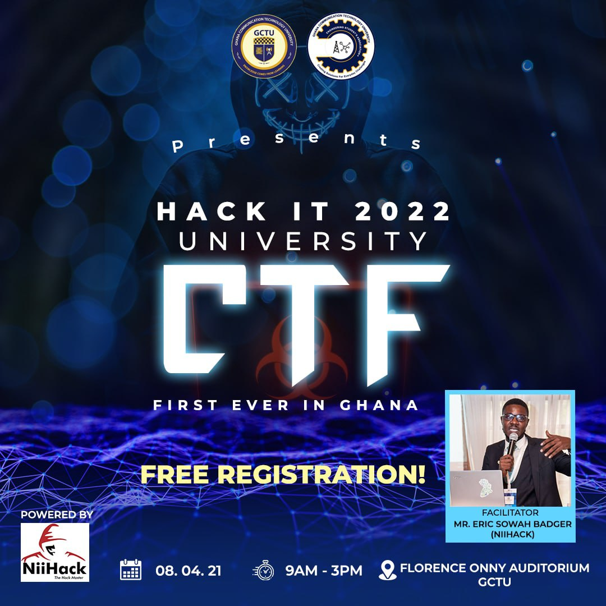

# [HACK-IT CTF 2022 (GHANA COMMUNICATION TECHNOLOGY UNIVERSITY)](http://137.184.185.175/)

### username: papilio  
### position: 1st  
### points: 1170 points  
### [Score Board](http://137.184.185.175/scoreboard)  

* [Facebook](https://www.facebook.com/brakhobbykurtiz).
* [Instagram](https://www.instagram.com/brakhobbykurtiz/).
* [LinkedIn](https://gh.linkedin.com/in/aaron-will-djaba-424b7a184).
* [Quora](https://www.quora.com/profile/Aaron-Will-Djaba).
* [Twitter](https://twitter.com/brakhobbykurtiz).
* [e-Mail: OutLook](mailto:aaronwilldjaba@outlook.com).
* [e-Mail: Gmail](mailto:papiliocurtis@gmail.com).
* [My Website](https://aaron.ourtechnologies.org)

This is a writeup for the HACK-IT ctf challenge. This writeup entails my thought process through challenge
and how I solve them. I couldn't solve all challenges, so I asked colleagues who participated in
the ctf and also the organizers to help. I will try as much possible to make it easy to understand.
 
# SOLVED
| Challenge                                   | Category  | Score  |
|---------------------------------------------|-----------|--------|
| [The Rules](Warm Up/the rules/the_rules.md) | Warm Up   | 10     |
| [Warm Up 1](Warm Up/warm up 1/warm_up_1.md) | Warm Up 1 | 10     |
| [Warm Up 2](Warm Up/warm up 2/warm_up_2.md) | Warm Up 2 | 10     |
| [Warm Up 3](Warm Up/warm up 3/warm_up_3.md) | Warm Up 3 | 10     |
Have fun solving the challenges 😉