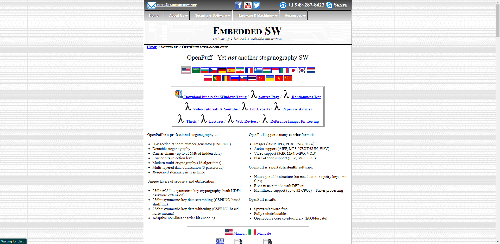

# Open the Puff - 50 points

> The hacker H3x has hacked the school's website and changed the credentials to the webserver. 
> Upon investigations, it was noticed she has hidden the credentials in an image.
> 
> Can you get the credentials of the webserver back.
> 
> Hint: Password is P@ssW0rd123@@
> 
> Flag Format: HACKIT{username:password}
> 
>> Unlock Hints for 30 points
> 
> [File: amn.png](http://137.184.185.175/files/e4e2a7059a4de16e663e4c42f5098475/amn.PNG?token=eyJ1c2VyX2lkIjoyMCwidGVhbV9pZCI6bnVsbCwiZmlsZV9pZCI6MjR9.YmE24A.qFePCk_uQaciZh6IcH1XTdGG6-8)
> 
> Author: [William](https://www.inveteckglobal.com/)

## Solution
We know from the challenge description that the new credentials has been store in an 
[image](http://137.184.185.175/files/e4e2a7059a4de16e663e4c42f5098475/amn.PNG?token=eyJ1c2VyX2lkIjoyMCwidGVhbV9pZCI6bnVsbCwiZmlsZV9pZCI6MjR9.YmE24A.qFePCk_uQaciZh6IcH1XTdGG6-8)
which has been provided. Another hint was given: `Password is P@ssW0rd123@@`. 
At first glance I thought the password hint was the password, which mean I just had to find the username.

I downloaded the file and tried to look up the metadata of the image file using a tool I will name in the next challenge.
It was a dead end. I then remembered the name of the challenge `Open the Puff` sounded familiar. I looked it up on 
google and found a tool for Steganography call `OpenPuff`. (search results may differ depending on how you surf the 
internet)

I downloaded it ([link](https://embeddedsw.net/zip/OpenPuff_release.zip)) and extracted it.
To use this on linux you need to have wine libraries installed. Read how to install and configure wine 
[here](https://wiki.winehq.org/Wine_Installation_and_Configuration). 
I open the extracted folder and launch OpenPuff.exe (Windows) or OpenPuff.sh (linux).

* I clicked `Unhide` button 

* I unticked these checkboxes

it looked like this

* I filled the `Cryprography` text box with the Password provided as hint in the challenge description
`P@ssW0rd123@@`

* I clicked on add carrier. Since the image provided was embedded with the encrypted message 
I figure it would be the carrier, navigated to folder containing the file and selected it.

* I then clicked `Unhide` button and selected the path the results would be dumped and clicked ok.

* I opened the folder the where the result was dumped (which in my case was the same folder of 
the OpenPuff program). the filename was `credentials.txt`

I found the username and the password `Administrator:paswkkwiw3929220020`. Putting our discovery in
the flag format the flag will be `HACKIT{Administrator:paswkkwiw3929220020}`

> Flag: HACKIT{Administrator:paswkkwiw3929220020}