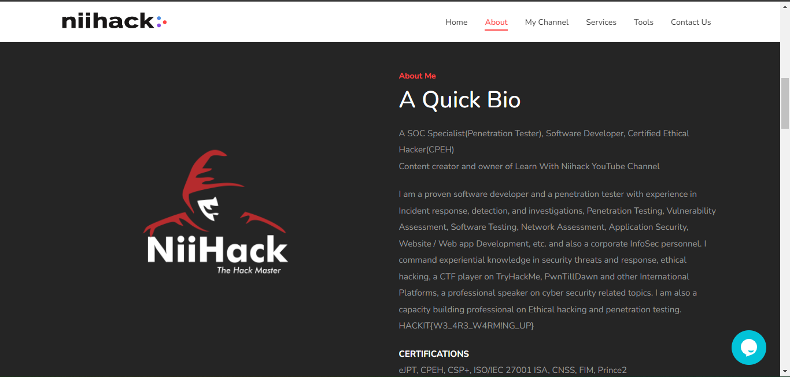
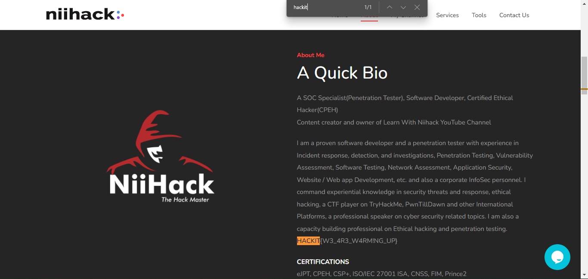

# Warm up 3 - 10 points
>Get started with HACKIT UNIVERSITY CTF CHALLENGE 2022.
>
>Your flag is found here: https://www.niihackgh.com
>
>Author: [NiiHack](https://www.niihackgh.com)

## Solution
A hint was given here. `Your flag is found here: https://www.niihackgh.com`
I visited the site which is the website of the facilitator of the CTF

There was obviously a lot of content there, so finding the flag by just reading
through by my self wouldn't be a good idea. I used the search (find) feature in the browser
`ctrl + f` and searched for the first part of the flag format which is `hackit`

you can see in the screenshot that the flag was found and highlighted
`HACKIT{W3_4R3_W4RM!NG_UP}`

> Flag: HACKIT{W3_4R3_W4RM!NG_UP}